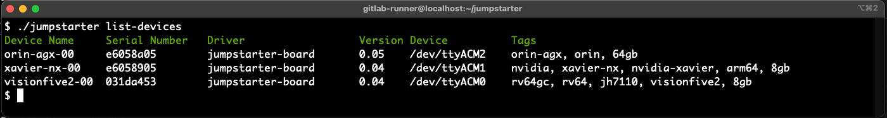

To start using Jumpstarter you need a [test-harness](../test-harness/) (i.e., a [jumpstarter-board](../test-harness/jumpstarter-board/)) and a device under test (DUT).

You will also need an image to flash into your DUT, it could be an .iso or a raw device image. In the case of the jumpstarter-board, this image
is flashed on a usb storage device which then can be attached to the DUT.

## Installation



# install jumpstarter binary
wget https://github.com/redhat-et/jumpstarter/releases/download/${JUMPSTARTER_VERSION}/jumpstarter-${JUMPSTARTER_VERSION}-linux-amd64.tar.gz
tar -xzf jumpstarter-${JUMPSTARTER_VERSION}-linux-amd64.tar.gz
export PATH=${PATH}:$(pwd)



## Setup

If you will be using a test harness that works through USB (like the jumpstarter-board), it is recommended to use a
physical host. QEMU is still possible but you will need to pass through the whole USB host controller to the VM, this
is recommended because the USB devices will come and go as devices are manipulated through the test-harness.

## Hello World
You can use the jumpstarter list-devices command to get a list of detected devices from your drivers.

