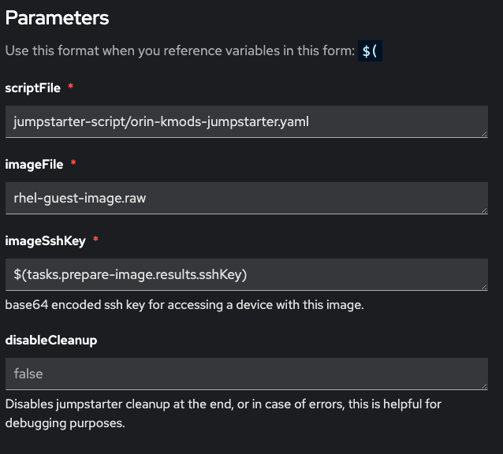
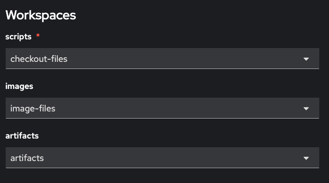

{}
We can integrate with OpenShift pipelines/tekton by using a tekton task co-located with the hardware.
{}

{}

[Tekton](https://tekton.dev/) is an open-source, cloud-native framework for creating and managing CI/CD workflows, enabling automation of software build, test, and deployment pipelines on Kubernetes. It's designed for flexibility, scalability, and supports various development tools and languages across different cloud environments.

To use Jumpstarter in Tekton, you need to create a custom task (see [jumpstarter-script task](https://github.com/jumpstarter-dev/jumpstarter/blob/main/tekton/pipelines/task-jumpstarter-script.yaml) for an example), and then use it in your pipeline.

You can find a complete example in the tekton directory: [Jumpstarter in Tekton](https://github.com/jumpstarter-dev/jumpstarter/tree/main/tekton).

The directory provides an example pipeline, and a custom task to use Jumpstarter in Tekton.
{}
Pipeline diagram
{}

The `git-clone` task checkouts [a repository which contains a jumpstarter script](https://github.com/mangelajo/jumpstarter-on-tekton/tree/main/jumpstarter-script), and an ansible
playbook. The jumpstarter script uses the ansible playbook on a later stage, when the
DUT is already powered, booted, and connected to the host to perform more complex tasks.

The `prepare-image` task is an example task performing some initial preparation of the image
we want to deploy on the DUT.

We will focus on the `run-jumpstarter-script` task, which is the one that uses Jumpstarter.

This task receives the following parameters:



And the following workspaces:



* `scripts` is the base directory for the scriptFile reference. This is where we would usually
  checkout a repository containing the scriptFile.

* `images` is the base directory for the imageFile reference. This is the workspace where
  preceding pipeline tasks would have copied the image to deploy on the DUT.

* `artifacts` is the directory where resulting task artifacts will be copied to. We expect
  the jumpstarter script to generate any artifacts in the `artifacts` diretory which will be copied to the `artifacts` workspace.


Calling our example pipeline from command line can be performed with:

```bash
$ tkn pipeline start jumpstarter-orin-nx \
	    --workspace name=checkout-files,volumeClaimTemplateFile=workspace-template.yaml \
       	--workspace name=image-input,claimName=lvm-rhel-image \
      	--workspace name=image-files,volumeClaimTemplateFile=workspace-templates/image-workspace-template.yaml \
       	--workspace name=artifacts,volumeClaimTemplateFile=workspace-templates/workspace-template.yaml \
       	--showlog
```
## Known limitations
The current implementation is not aware of the nodes where test harnesses could be attached (i.e. if there is a direct physical connection from host to hardware like in the dutlink board).

Some future test harneses could be network-driven, that would remove this limitation. Or future jumpstarter arquitectures could be accessed via a broker. A temporary solution
could be to use a `nodeSelector` to make sure the tasks are scheduled in the node(s) where
the hardware is available. But that would not fully acount for scheduling/availability.

### Future work
To address test harness allocation and pod scheduling we are looking into the following options:

 * Device plugin API: this is the simplest solution, although the least flexible, since there
   is a 1:1 usage mapping between pods and devices. Some test-harnesses could allow multiple
   pods accessing the same device, i.e. when there is a (CAN) bus or network involved.

 * Device Resource Allocation API, this API is much more flexible and allows device sharing between pods, it's in alpha state but very likely to be promoted as it's driven by NVIDIA and Intel: https://kubernetes.io/docs/concepts/scheduling-eviction/dynamic-resource-allocation/ , an example driver can be found here: https://github.com/kubernetes-sigs/dra-example-driver .
